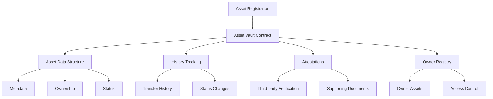

# Bundle Tunnel

A secure and transparent blockchain protocol for tracking, verifying, and transferring digital and physical assets using decentralized technology on the Stacks blockchain.

## Overview

Bundle Tunnel provides a comprehensive ecosystem for asset management, enabling:
- Immutable asset registration
- Secure and traceable ownership transfers
- Comprehensive provenance tracking
- Third-party attestation and verification
- Dynamic asset status management
- Complete historical record preservation

Ideal use cases include:
- Luxury goods authentication
- Real estate and property tracking
- Intellectual property management
- High-value asset certification
- Cross-border asset verification

## Architecture

The system is built around a central asset vault contract that manages all asset-related operations and maintains several interconnected data structures.



## Contract Documentation

### Bundle Tunnel Contract

The core contract (`bundle-tunnel.clar`) manages comprehensive asset tracking, verification, and transfer mechanisms.

#### Key Data Structures
- `assets`: Stores core asset information
- `asset-history`: Tracks ownership transfers
- `asset-attestations`: Stores third-party verifications
- `principal-assets`: Maps owners to their assets

#### Access Control
- Asset modifications restricted to current owner
- Attestations can be added by any principal
- Transfers require current owner authorization

## Getting Started

### Prerequisites
- Clarinet
- Stacks wallet for deployment

### Installation
1. Clone the repository
2. Install dependencies with Clarinet
3. Deploy contract to desired network

### Basic Usage

```clarity
;; Register a new asset
(contract-call? .bundle-tunnel register-asset 
    "Vintage Rolex Submariner" 
    u75000 
    u1675382400 
    "Pristine Condition" 
    (some "ipfs://bafyexamplemetadata"))

;; Transfer asset ownership
(contract-call? .bundle-tunnel transfer-asset 
    u1 
    'ST1PQHQKV0RJXZFY1DGX8MNSNYVE3VGZJSRTPGZGM 
    (some "Collector Acquisition"))
```

## Function Reference

### Public Functions

#### register-asset
```clarity
(define-public (register-asset 
    (description (string-ascii 256))
    (value uint)
    (date-acquired uint)
    (condition (string-ascii 64))
    (metadata-uri (optional (string-utf8 256))))
```

#### transfer-asset
```clarity
(define-public (transfer-asset
    (asset-id uint)
    (new-owner principal)
    (notes (optional (string-ascii 256))))
```

#### add-attestation
```clarity
(define-public (add-attestation
    (asset-id uint)
    (attestation-type (string-ascii 64))
    (details (string-utf8 256))
    (uri (optional (string-utf8 256))))
```

### Read-Only Functions

#### get-asset
```clarity
(define-read-only (get-asset (asset-id uint)))
```

#### get-assets-by-owner
```clarity
(define-read-only (get-assets-by-owner (owner principal)))
```

## Development

### Testing
Run the test suite using Clarinet:
```bash
clarinet test
```

### Local Development
1. Start Clarinet console:
```bash
clarinet console
```
2. Deploy contract:
```bash
(contract-call? .asset-vault ...)
```

## Security Considerations

### Limitations
- Asset metadata size limited to 256 characters
- Maximum 100 assets per principal
- No built-in encryption for sensitive metadata

### Best Practices
- Always verify asset ownership before transfers
- Use secure URIs for sensitive metadata storage
- Keep detailed transfer notes for audit purposes
- Regularly monitor asset status and attestations
- Validate all inputs before registration

### Error Handling
The contract includes comprehensive error codes:
- `ERR-NOT-AUTHORIZED (u100)`
- `ERR-ASSET-NOT-FOUND (u101)`
- `ERR-INVALID-DETAILS (u102)`
- `ERR-ALREADY-EXISTS (u103)`
- `ERR-UNAUTHORIZED-TRANSFER (u104)`
- `ERR-INVALID-RECEIVER (u105)`
- `ERR-UNAUTHORIZED-ATTESTATION (u106)`